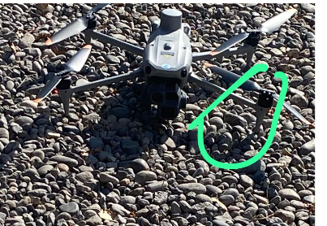
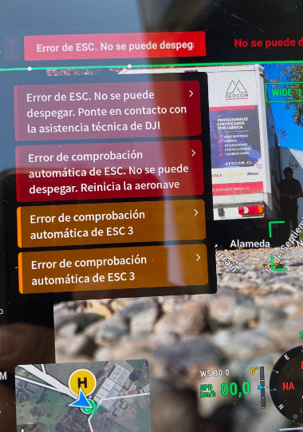
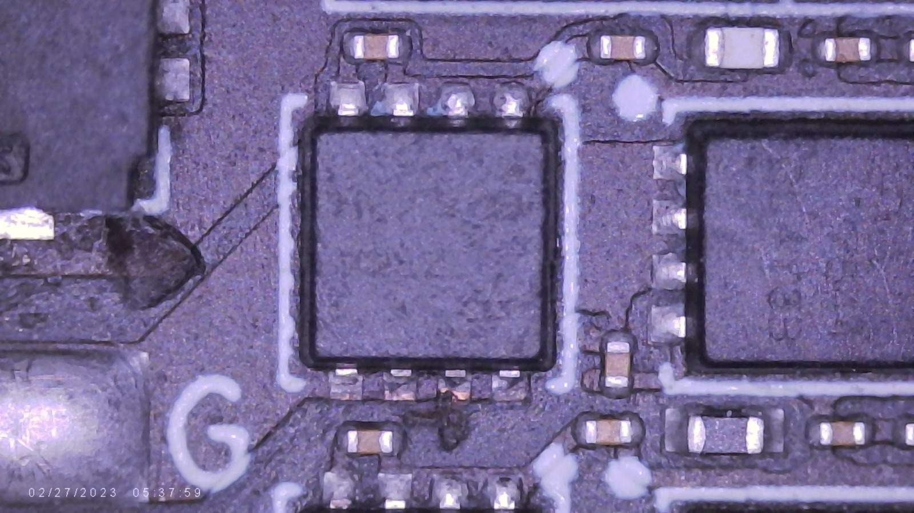
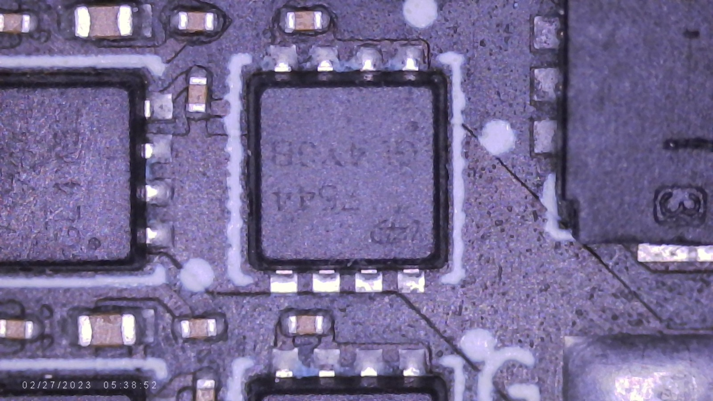

# Diagnóstico de Falla ESC 3 — MOSFET Degradado con Fuga Parcial

- Fecha de diagnóstico: 27-05-2026
- Equipo: DJI Matrice 4 Enterprise
- Módulo afectado: ESC 3

---

# Contexto

Durante operación de vuelo, el dron comenzó a inclinarse hacia el lado frontal izquierdo. Posteriormente apareció un error relacionado al ESC 3.

{ .center-img }

## Síntomas observados
- Tendencia del dron a cargarse hacia un lado.
- Error ESC 3 durante vuelo o tras reinicio.

{ .center-img }

---

# Procedimiento de Medición

## Consideraciones

Las mediciones fueron realizadas principalmente en:

- Modo diodo.
- Modo resistencia.

Se trabajó sin motor conectado para comprobar cada fase de la ESC 3.

---

# Mediciones Registradas

!!! note "Polaridades de Medición con Multímetro"

    **Low-side invertido**
    
    - Punta negra → GND
    - Punta roja → fase

    **Low-side (polaridad correcta)**
    
    - Punta roja → GND
    - Punta negra → fase

    **El High-side no se observó afectado durante las mediciones, por lo tanto no se especifica en las medidas registradas.**

## ESC 3
### Modo diodo — Low-side invertido
|Pin|Voltaje|
|-|-|
|Pin G| 1.28 V|
|Pin W| 1.65 V|
|Pin B| 1.65 V|

### Resistencia — Low-side (polaridad correcta)

|Pin|Resistencia|
|-|-|
|Pin G| 2.558 kΩ|
|Pin W| 3.301 kΩ|
|Pin B| 3.284 kΩ|

El Pin G presenta:

- menor caída de voltaje en modo diodo,
- y menor resistencia respecto a las demás fases.

Esto sugiere posible fuga parcial o degradación del MOSFET asociado a dicha fase.

## ESC 1 (Referencia Sana)
### Modo diodo — Low-side invertido
|Pin|Voltaje|
|-|-|
|Pin G| 1.64 V|
|Pin W| 1.664 V|
|Pin B| 1.65 V|

### Resistencia — Low-side (polaridad correcta)
|Pin|Resistencia|
|-|-|
|Pin G| 3.277 kΩ|
|Pin W| 3.272 kΩ|
|Pin B| 3.277 kΩ|

# Hallazgo Bajo Microscopio
Durante inspección visual:

- El MOSFET sospechoso mostró indicios de quemadura en los pines inferiores.
- Se observó daño térmico.

## ESC 3 (MOSFET dañado)
{ .center-img }

## ESC 4 (Referencia Visual Sana de MOSFET)
{ .center-img }

# Conclusiones
La degradación del MOSFET asociado al ESC 3 provocó un comportamiento anómalo en la etapa de conmutación low-side, evidenciado por la disminución de resistencia y la diferencia de mediciones respecto a las demás fases.

Esta degradación probablemente generó una conducción irregular y un aumento de corriente durante la conmutación de la fase afectada, alterando el control de velocidad del motor correspondiente al brazo M3.

Durante el vuelo, esto se manifestó como una tendencia del dron a inclinarse hacia el lado frontal izquierdo, coherente con una anomalía de empuje en el brazo trasero derecho (M3). Finalmente, la falla derivó en la generación del error ESC 3.

# Acción Correctiva

- ESC marcado como no confiable para vuelo.
- Se recomienda reemplazo del ESC o del MOSFET afectado.
