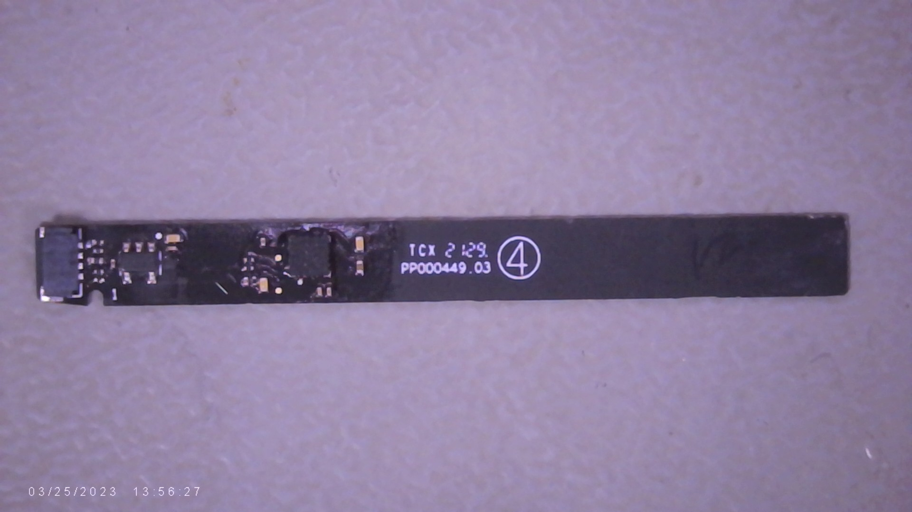
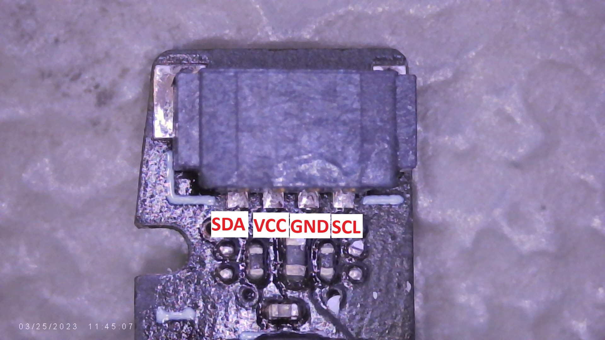
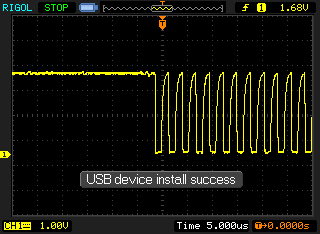
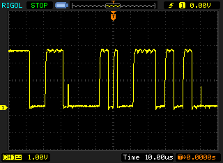
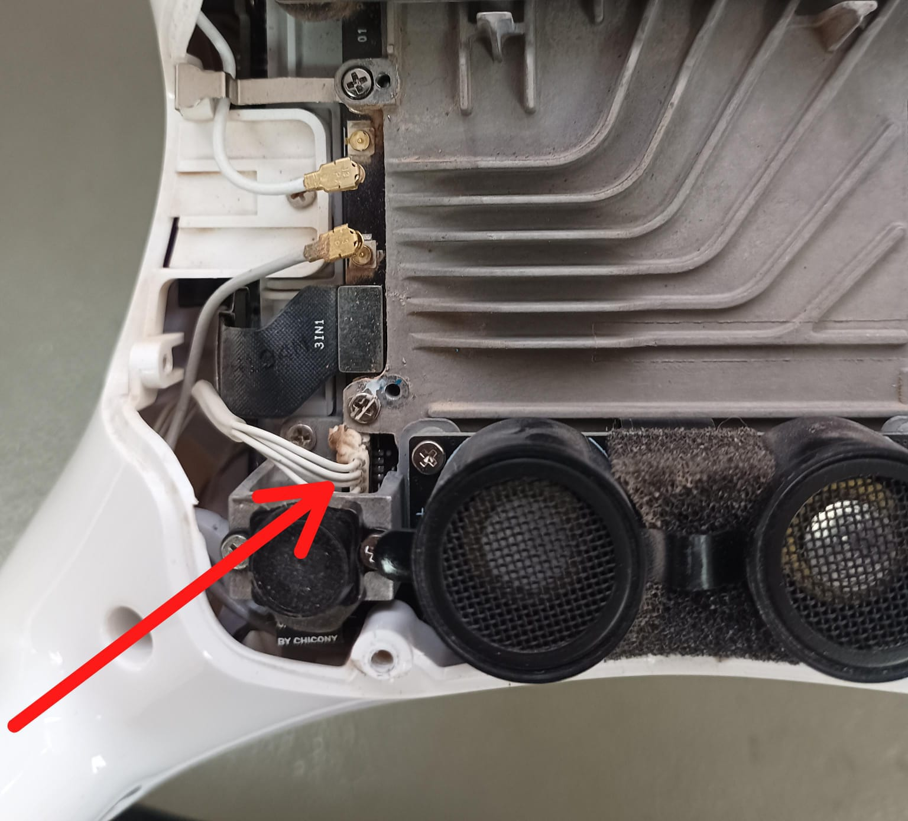

# Análisis de la Interfaz de Comunicación del Módulo de Brújula del Tren de Aterrizaje DJI Phantom 4 RTK

Fecha: 23/06/2026

---

## Objetivo

Determinar el protocolo de comunicación utilizado por el módulo brújula ubicado en el tren de aterrizaje del DJI Phantom 4 RTK e investigar si este puede estar relacionado con casos en los que reemplazos del conjunto no son reconocidos por la aeronave.

## Antecedentes

Durante intervenciones anteriores se observó que algunos conjuntos de tren de aterrizaje de reemplazo no eran reconocidos correctamente por la aeronave. Esto generó la necesidad de identificar el método de comunicación utilizado por el módulo brújula y evaluar posibles causas relacionadas con la comunicación entre este y el controlador de vuelo.

Considerando la cantidad de conductores presentes en el conector y el tipo de sensor involucrado, se planteó como hipótesis que la comunicación se realizaba mediante un bus I²C.

{ width="80%" .center-img }

## Metodología

Se desmontó un conjunto de tren de aterrizaje funcional de un DJI Phantom 4 RTK con el fin de inspeccionar el módulo brújula y su interfaz de conexión.

Mediante inspección visual y seguimiento de pistas se identificó la siguiente distribución de pines:

| Pin | Función |
|-----|----------|
| 1 | SDA |
| 2 | VCC |
| 3 | GND |
| 4 | SCL |

{ width="80%" .center-img }

---

# Observaciones

## Línea SCL

La línea SCL presentó un estado de reposo en nivel alto y actividad periódica consistente en trenes de pulsos de reloj.

Características observadas:

- Estado de reposo en nivel lógico alto.
- Presencia de pulsos de reloj durante eventos de comunicación.
- Comportamiento compatible con una línea de reloj de un bus I²C.

{ width="80%" .center-img }

## Línea SDA

La línea SDA presentó un estado de reposo en nivel alto y cambios de estado sincronizados con la actividad observada en la línea SCL.

Características observadas:

- Estado de reposo en nivel lógico alto.
- Transiciones de datos durante la actividad de reloj.
- Comportamiento consistente con una línea de datos bidireccional de un bus I²C.

{ width="80%" .center-img }

---

# Resultados

El comportamiento observado en las líneas SDA y SCL coincide con las características eléctricas esperadas para una interfaz I²C, incluyendo líneas en estado de reposo alto, presencia de una señal de reloj dedicada y transmisión de datos sincronizada con dicha señal.

Los principales indicios son:

- Interfaz compuesta por cuatro conductores: SDA, VCC, GND y SCL.
- Existencia de una línea de reloj dedicada.
- Actividad de datos sincronizada con la señal de reloj.
- Estado de reposo en nivel alto para ambas líneas de comunicación.

---

# Aplicación Diagnóstica

Ante casos en los que un módulo de brújula o un conjunto de tren de aterrizaje no sea reconocido por la aeronave, se recomienda verificar:

- Presencia de alimentación en el módulo.
- Actividad en la línea SCL durante el arranque.
- Actividad en la línea SDA durante la inicialización.
- Integridad física de las líneas SDA y SCL.
- Existencia de respuestas del dispositivo a las solicitudes del controlador de vuelo.

La ausencia de actividad en el bus o la falta de respuesta por parte del módulo podrían indicar una falla de comunicación, alimentación o compatibilidad entre el dispositivo y la aeronave.

{ width="80%" .center-img }

---

# Conclusión

A partir de las observaciones realizadas mediante osciloscopio y del análisis de la interfaz física del módulo, se concluye que la comunicación entre el módulo de brújula del tren de aterrizaje y el controlador de vuelo del DJI Phantom 4 RTK se realiza mediante un bus I²C.

La hipótesis inicial queda respaldada tanto por la distribución de pines identificada (SDA, VCC, GND y SCL) como por el comportamiento eléctrico observado en las líneas de comunicación.

Este hallazgo proporciona una base para futuros procedimientos de diagnóstico relacionados con módulos de brújula o trenes de aterrizaje que no sean reconocidos correctamente por la aeronave.

