# Formateo de tarjeta Micro SD para Phantom 4 RTK

## Nota importante

Para utilizar una tarjeta Micro SD con el Phantom 4 RTK, se debe considerar un almacenamiento máximo absoluto de **128 GB**.

---

# Pasos para formatear tarjeta Micro SD para Phantom 4 RTK

## 1. Insertar tarjeta Micro SD en computadora

Insertar la tarjeta Micro SD en la computadora utilizando un lector compatible.

---

## 2. Abrir menú de formato

Una vez insertada la tarjeta Micro SD:

1. Hacer clic derecho sobre la unidad
2. Seleccionar la opción **"Formatear..."**

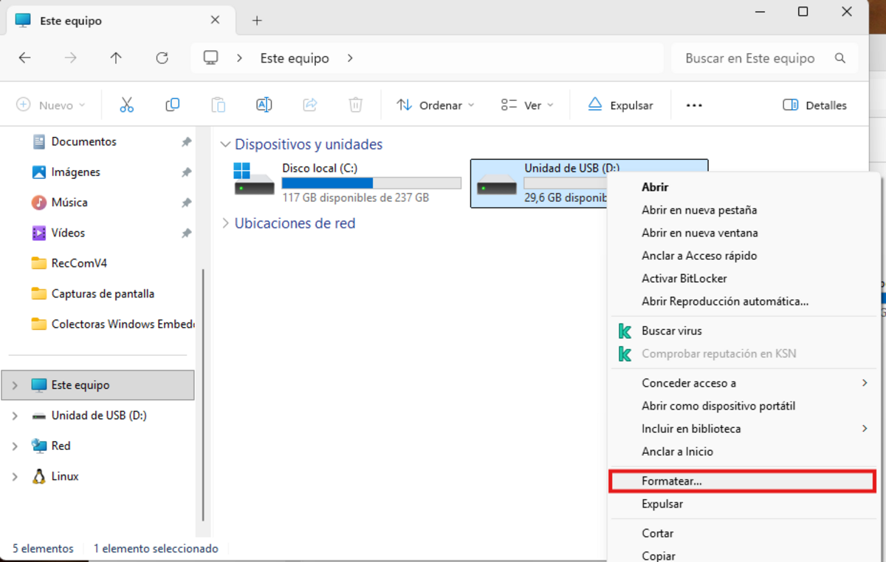

---

## 3. Seleccionar sistema de archivos

En la ventana de formato:

- Seleccionar: **Sistema de archivos:** `FAT32`
- Ingresar cualquier nombre en: **Etiqueta del volumen**
- Mantener activada la opción: **Formato rápido**

Luego presionar **"Iniciar"**

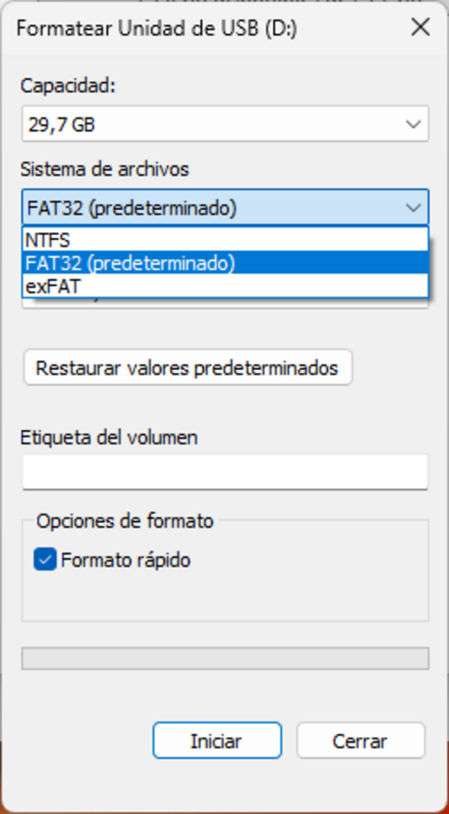{ width="50%" }

---

## 4. Confirmar advertencia

Cuando aparezca la ventana de advertencia, presionar:

- **Aceptar**

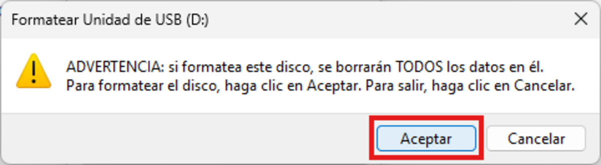{ width="75%" }

---

## 5. Esperar finalización

Esto completará el proceso de formato en PC.

---

# Compatibilizar Micro SD con Phantom 4 RTK

## 6. Insertar Micro SD en control RC

Insertar la tarjeta Micro SD en el slot del control RC del Phantom 4 RTK.

El slot se encuentra ubicado en el lado inferior derecho del control.

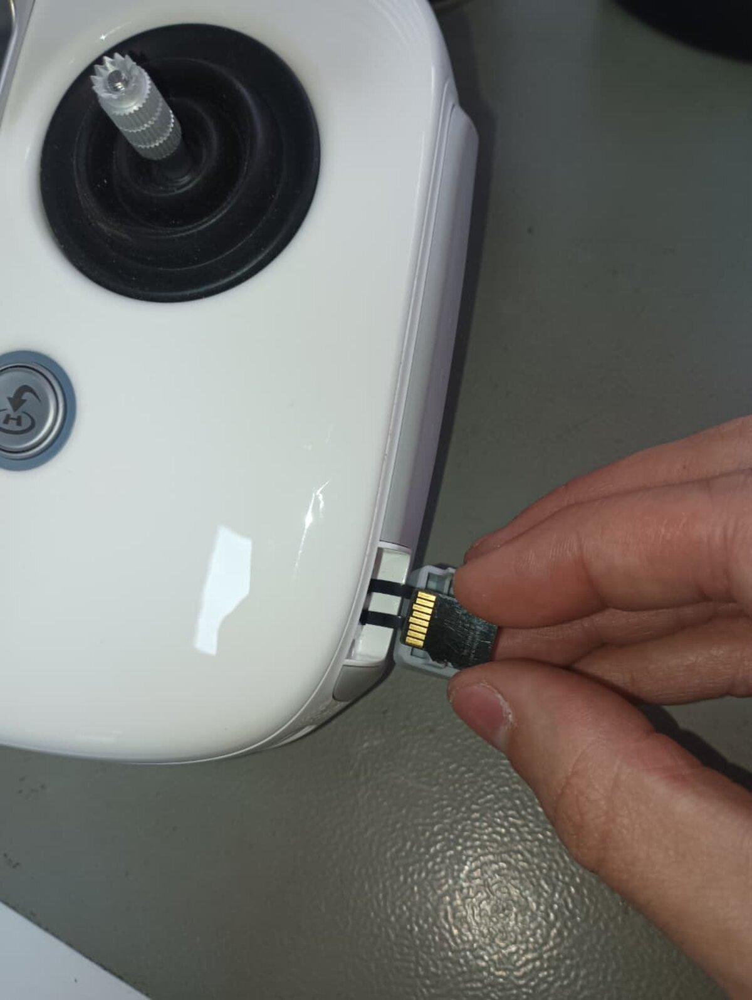{ width="75%" }

---

## 7. Abrir menú principal del control RC

Con el control RC encendido:

1. Presionar las tres barras paralelas ubicadas en la esquina superior izquierda.

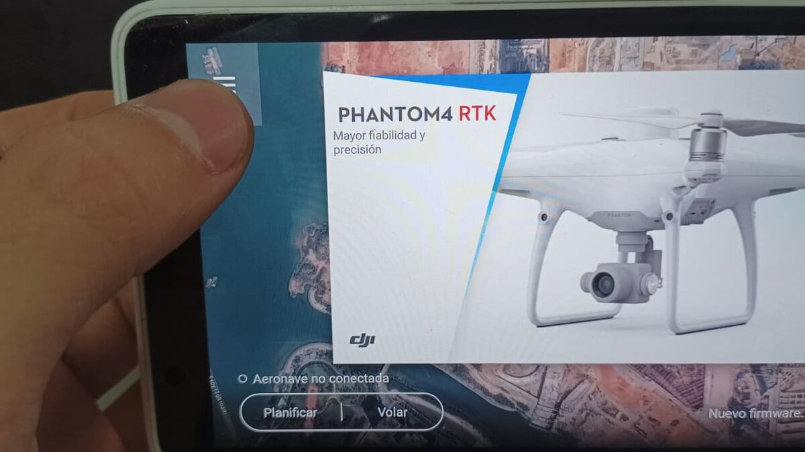

---

## 8. Abrir configuraciones

Presionar el botón de configuraciones (símbolo de tuerca).

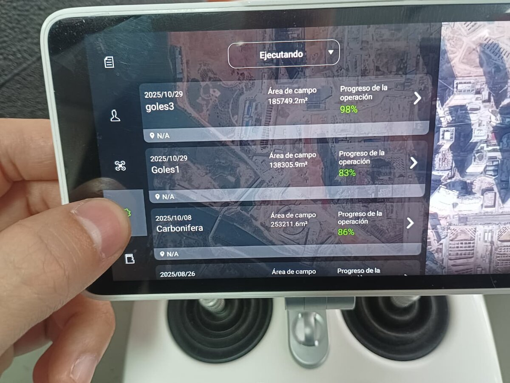

---

## 9. Abrir almacenamiento

Dentro del menú de configuraciones:

1. Bajar hasta la sección **"Dispositivo"**
2. Seleccionar **"Almacenamiento"**

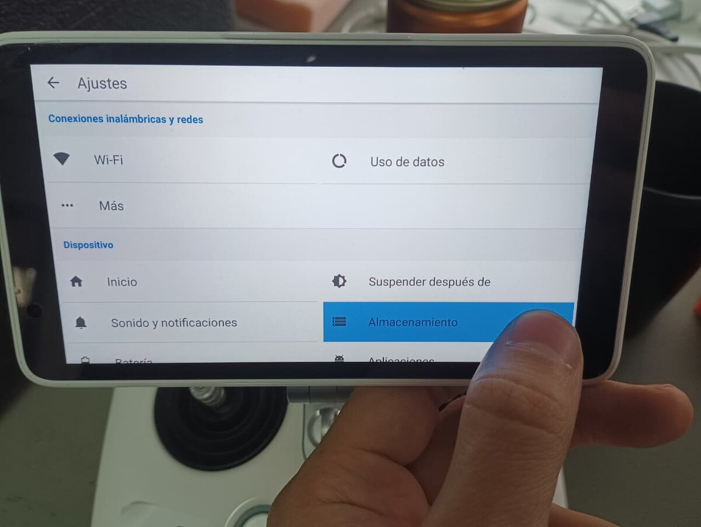

---

## 10. Borrar tarjeta SD

Dentro de la sección **"Tarjeta SD"**:

1. Presionar **"Borrar tarjeta SD"**

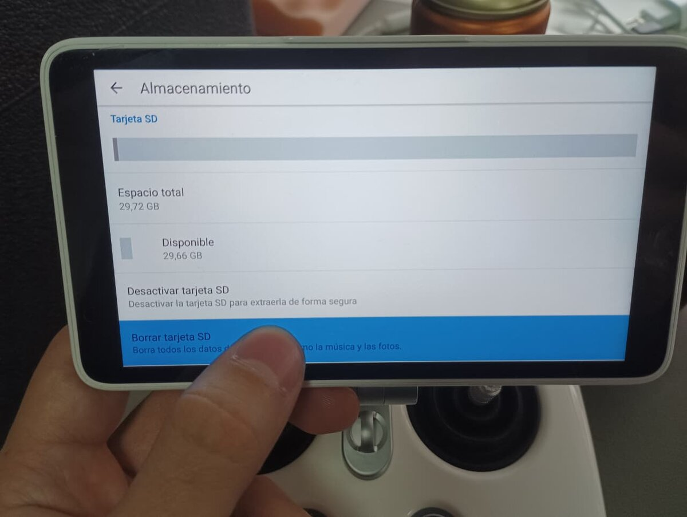

---

## 11. Confirmar eliminación

El sistema solicitará confirmación:

1. Presionar:
   - **BORRAR TARJETA SD**
2. Confirmar nuevamente con:
   - **BORRAR TODO**

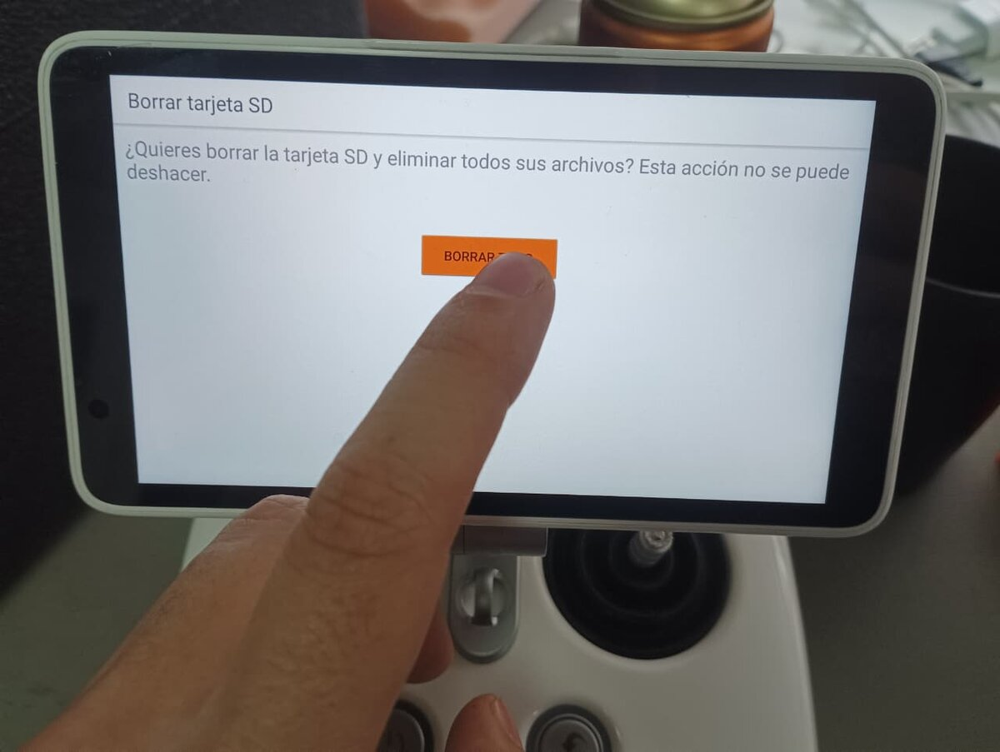

---

## 12. Esperar finalización del proceso

Esto iniciará el proceso de formateo compatible con el Phantom 4 RTK.

Esperar a que el proceso termine completamente.

---

## 13. Insertar Micro SD en dron

Una vez finalizado el proceso:

1. Retirar la tarjeta Micro SD del control RC
2. Insertarla en el dron Phantom 4 RTK

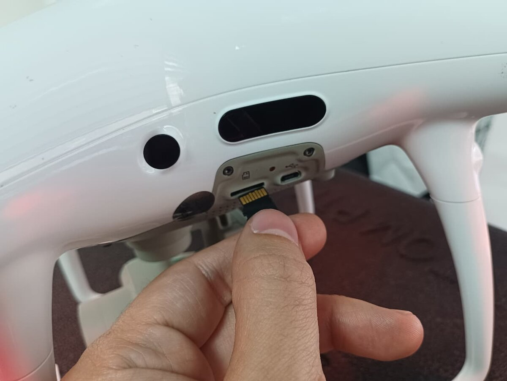

---

# Verificación de funcionamiento

Ingresar a la vista de cámara del dron en DJI Pilot.

En el menú desplegable ubicado en la esquina superior derecha:

- El apartado **"SD Capacity"** debería mostrar:
  - cantidad estimada de fotografías disponibles

No deberían aparecer mensajes como:

- `Unknown Micro SD Error`

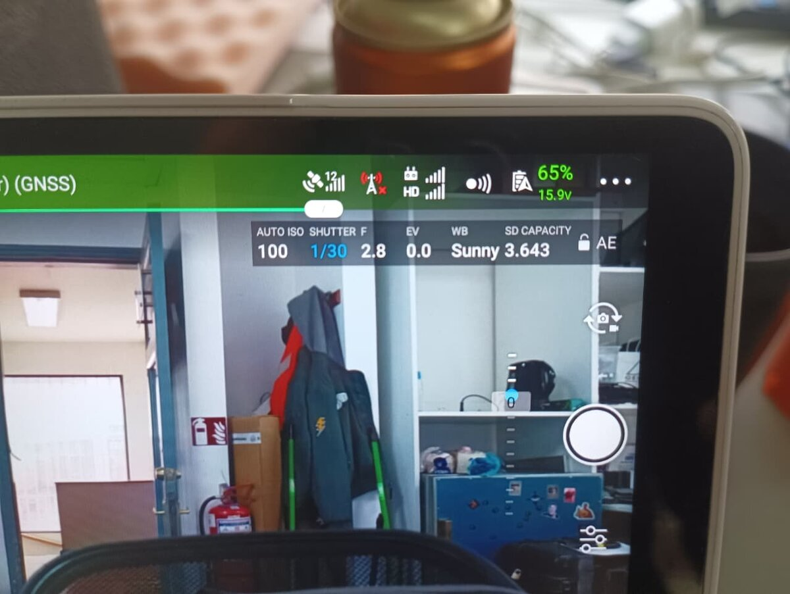

---
