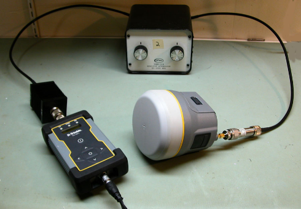
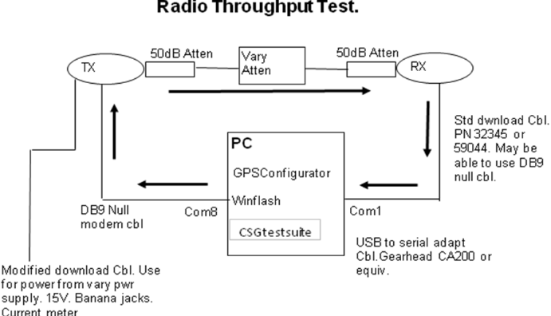
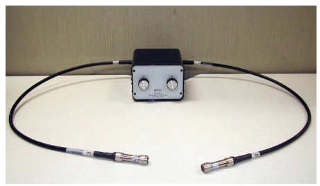

# Procedimiento de Prueba de Throughput de Radio UHF

**Implementación del laboratorio:**

{ .center-img }

## Objetivo

Este procedimiento describe la implementación del banco de pruebas de throughput de radio utilizado en el laboratorio para evaluar el funcionamiento y la salud de los radios UHF instalados en receptores GNSS Trimble.

Este procedimiento se basa en el documento [**Trimble Radio Throughput Test Service Manual (P/N 65306-SVC Rev. F)**](https://drive.google.com/file/d/19o1DHanCRYbwoAKr-1SYVM6f3Ll8Roej/view?usp=sharing). Para información detallada sobre teoría de operación, configuración de equipos y solución de problemas, consultar el manual de Trimble.

---

## Configuración del Banco de Pruebas en el Laboratorio

```text
Radio TX (Base/UUT (Unit Under Testing)) <- USB -> PC (Windows 7)
        │
Atenuador fijo de 50 dB WEINSCHEL
        │
Atenuador variable JFW 50BR-016 (de 0 a 90 dB)
        │
Atenuador fijo de 50 dB WEINSCHEL
        │
Radio RX (TDL450H/L o Rover GNSS) <- USB -> PC (Windows 7)
```

{ .center-img }

### Nota importante

El sistema incorpora dos atenuadores fijos de 50 dB, por lo que la atenuación total aplicada es:

```text
Atenuación total = Ajuste variable del atenuador JFW + 100 dB
```

Ejemplos:

| Ajuste JFW | Atenuación total |
| ---------: | ---------------: |
|       0 dB |           100 dB |
|      20 dB |           120 dB |
|      30 dB |           130 dB |
|      45 dB |           145 dB |
|      90 dB |           190 dB |

**Atenuador variable JFW 50BR-016 con atenuadores de 50 dB WEINSCHEL instalados en cada terminal:**

{ .center-img }

---

## Unidad de Referencia (Gold Unit)

La unidad de referencia de prueba (*Gold Unit*) utilizada actualmente en el laboratorio corresponde a una radio **Trimble TDL450H**, configurada de la siguiente manera:

- Espaciado de canal: **25 kHz**
- Velocidad del enlace serial (*Serial Link*): **38400 baud**
- Velocidad del enlace de radio (*Radio Link*): **9600 baud**
- Rango de frecuencias: **430-470 MHz**

> **Nota:** Estos parámetros corresponden a la configuración actualmente utilizada en el laboratorio y pueden modificarse según los requisitos de la prueba o la configuración del equipo bajo evaluación.

---

## Procedimiento General

### 1. Configurar equipos
Configurar el transmisor y el receptor de acuerdo con el procedimiento indicado en el manual de Trimble.

**Ejemplo (R12i como transmisor):**

1. Configurar el receptor en modo **Base**.
2. Acceder a la **Web UI** del receptor.
3. Configurar un **Relay** entre el puerto serial y la radio interna, de forma que los paquetes generados por **SGS Test Suite** sean transmitidos a través de la radio UHF.
4. Verificar que la frecuencia, protocolo y velocidad del enlace inalámbrico coincidan con la configuración del receptor (RX), que en el caso del laboratorio es una TDL450H.

### 2. Verificar la configuración
Verificar que ambos equipos tengan la misma configuración:

- Frecuencia
- Protocolo de radio
- Velocidad del enlace inalámbrico
- Espaciado de canal

### 3. Realizar las conexiones
Realizar las conexiones según el diagrama del banco de pruebas.

### 4. Iniciar la prueba
Iniciar la prueba de throughput mediante CSGTestSuite.

### 5. Verificar recepción
Verificar que se estén recibiendo paquetes.

### 6. Verificar el banco de pruebas
Aumentar la atenuación hasta provocar pérdida total de señal para confirmar el correcto funcionamiento del banco de pruebas.

### 7. Ajustar la atenuación
Ajustar la atenuación al valor especificado en la tabla de atenuación correspondiente al equipo bajo prueba.

### 8. Ejecutar la prueba
Ejecutar la prueba durante:

- Al menos 10 minutos, o
- Un mínimo de 500 paquetes transmitidos.

---

## Interpretación de Resultados

### Resultado satisfactorio (PASS)

* El porcentaje de paquetes recibidos es **≥ 95 %** luego de 10 minutos de funcionamiento continuo.
* El comportamiento es consistente con el de equipos de referencia conocidos como funcionales.

### Resultado no satisfactorio (FAIL)

* El porcentaje de paquetes recibidos es **< 95 %** luego de 10 minutos de funcionamiento continuo.
* El equipo presenta pérdida de paquetes significativamente mayor que las unidades de referencia.
* No se recibe señal en niveles de atenuación donde las unidades de referencia operan correctamente.

---

## Verificación Opcional

La potencia esperada en recepción puede estimarse mediante:

```text
PRX (dBm) = PTX (dBm) - Atenuación total - Pérdidas adicionales
```

Ejemplo:

```text
PTX = +33 dBm
JFW = 45 dB
Atenuación total = 145 dB
PRX esperado ≈ -112 dBm
```

Diferencias de aproximadamente ±1–2 dB respecto al valor calculado se consideran normales debido a tolerancias de los componentes y pérdidas de inserción. La documentación del atenuador variable JFW 50BR-016 describe una atenuación de inserción nominal de 1.5 dB, por ejemplo.

---

## Referencias

* [Trimble Radio Throughput Test Service Manual, P/N 65306-SVC Rev. F](https://drive.google.com/file/d/19o1DHanCRYbwoAKr-1SYVM6f3Ll8Roej/view?usp=sharing).
* [Tabla de atenuación de radios Trimble vigente](https://drive.google.com/file/d/1ou1xTluWR4hyRd84WDZT1ZK6dg1R_Bmu/view?usp=sharing).
* Registros internos y mediciones de referencia del laboratorio.
