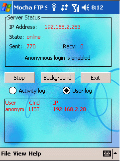
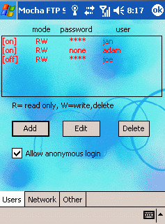

# WMFTP - Servidor FTP para Windows Mobile

## Descripción

Mocha FTP Server facilita la transferencia de archivos desde y hacia colectoras con Windows Mobile o Pocket PC 200x.

El software es compatible con las funciones estándar del Protocolo de Transferencia de Archivos (FTP), permitiendo acceso mediante:

- Explorador de archivos de Windows
- Navegadores web
- Clientes FTP dedicados como FileZilla

Descarga: [WMFTP](https://drive.google.com/drive/folders/1QM-8yb-tqlYiGh7M0THCtgeOhqJePBOu?usp=drive_link)

---

## Requisitos

- Colectora Trimble con Windows Mobile
- WMFTP instalado en la colectora
- Conexión de red entre PC y colectora

---

## Acceso desde PC

Si la colectora posee la dirección IP:

```text
192.168.2.232
```

Se puede acceder mediante:

```text
ftp://192.168.2.232
```

La dirección puede abrirse desde:

- Explorador de archivos
- Navegador web
- Cliente FTP

Esto permitirá acceder a los archivos almacenados en la colectora para:

- transferencia de datos
- respaldos
- recuperación de archivos
- carga de proyectos

---

## Pantallas de referencia

### Pantalla principal WMFTP

{ width="50%" .center-img }

---

### Pantalla de configuración WMFTP

{ width="50%" .center-img }

---

## Ventajas sobre transferencia USB

- Mayor estabilidad en transferencias
- Evita desconexiones USB intermitentes
- Permite respaldos remotos
- Compatible con clientes FTP avanzados
- Menor dependencia de drivers Windows Mobile

---

## Notas

- Verificar que PC y colectora se encuentren en la misma red
- Algunos firewalls pueden bloquear conexiones FTP
- Mantener la aplicación WMFTP abierta durante la transferencia